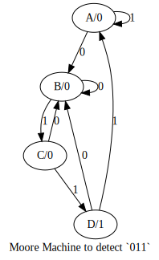

# fsmutil
Finite State Machines

## seq2fsm
Binary sequence detection FSMs ftw!

### What does it do?
Given a binary sequence, say, `011`, it'll generate the finite state machine (both Moore and Mealy) representation for the detector of the sequence. The files below are generated with it:

### How do I use it?
`python3 seq2fsm.py`

## author
Sayan Goswami :octocat:

